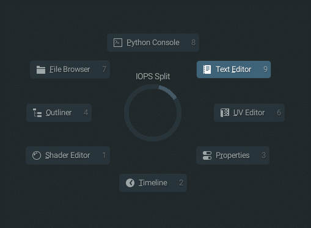

# Pie Menus

InteractionOps features radial pie menus for efficient operator access and viewport management.

## Main Pie Menu System

### iOps Pie

The central pie menu providing quick access to core InteractionOps functionality.

**Sections:**
- Core operators (F1-F5 equivalents)
- Quick selection tools
- Transform operations
- Mode switching
- Utility functions

### iOps Split View Pie

Advanced viewport splitting and area management through an intuitive pie interface.

**Split Options:**
- Horizontal/vertical splits
- Custom split ratios
- Area type selection
- Layout presets
- Multi-monitor support

## Pie Menu Features

### Navigation
- **Mouse Position**: Determines selection
- **Center Return**: Cancel operation
- **Quick Selection**: Directional gestures
- **Visual Feedback**: Highlight active sectors

### Customization
- **Sector Assignment**: Customize operator placement
- **Visual Styling**: Colors and icons
- **Activation Methods**: Hotkeys and gestures
- **Context Sensitivity**: Different pies per mode

## Usage Tips

**Efficient Workflow:**
- Use quick gestures for common operations
- Memorize pie directions for speed
- Combine with modifier keys for variations
- Create custom pie layouts for specialized tasks

**Activation Methods:**
- Hotkey press and hold
- Click and drag
- Context-sensitive triggers
- Custom gesture recognition